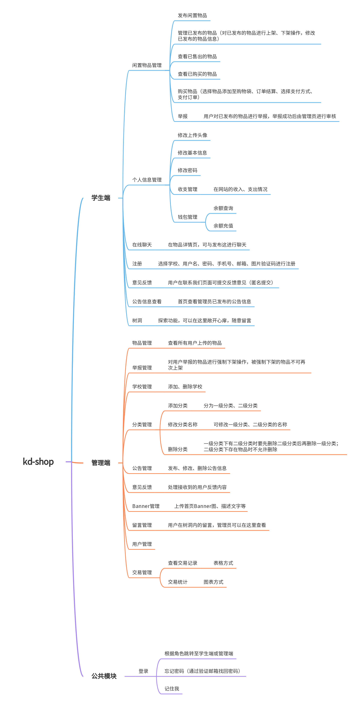

# 『kd-shop』科大二手工坊V2.0

> 不一定什么时候能全做完，反正每天都学一点做一点，最重要的是积累和坚持✊


🙆‍♀️项目的灵感是来源于我的2019年毕业设计：[科大二手工坊](https://github.com/lvr1997/kd-second-hand-workshop)；科大二手工坊是基于Java语言编写由SSM框架构建，页面是基于jsp+layui编写的，项目相关技术还比较老旧

🙋‍♀️而如今，由于我个人职业发展因素的变更以及前端技术的不断更新迭代，我想就这个项目，完成一个新的尝试。也作为我毕业这么长时间以来，对前端方面学习上的一些总结吧。

## ⚒️技术选型

前端页面使用Vue3+pinia+vue-router+AntDesignvue3。使用Vite构建工具搭建项目

对于后端服务，我主要为基于node+express搭建的项目进行更新，完成前后端的接口联调。

[node+express版本](https://github.com/lvr1997/kd-shop-api)
[SpringBoot版本](https://github.com/lvr1997/kd-shop)

最后，在时间和精力允许的情况下，我有可能还会引入mock的用法，作为拓展技能

kd-shop项目对我而言，我想实现在我职业技术生涯中的一项新的挑战。

### Vue3

kd-shop我想尝试用vue3新增的组合式API来完成这个项目

### Vite

vite相比webpack启动速度更快

### AntDesignVue3

[vue3+vite项目按需引入antdesign](https://flowus.cn/d489fabd-7b30-429a-93cd-77f0085c7f6e)

### Pinia

作为vue3新一代的状态管理插件

三个非常重要的点: state  getter  actions

### axios

[vue3+vite项目引入axios](https://flowus.cn/67decf35-1158-41c9-98b0-6956a608dd27)

## 📖项目介绍

一个专为各大高校开发的校园二手交易平台。实现校园内闲置物品的流通交易。真正让闲置物品“活”起来。

## 🧠项目脑图



## 📑项目需求

按学生、管理员不同角色登录，学生用户跳转到商铺页，管理用户登入到管理端页面（个人项目为方便维护，学生端和管理端公用一套系统）

先梳理下系统的几个页面：

| 学生端                                                       | 管理端   |
| ------------------------------------------------------------ | -------- |
| 首页                                                         | 闲置管理 |
| 闲置发布页                                                   | 交易管理 |
| 买闲置页                                                     | 举报管理 |
| 我的小铺页（个人发布、售出的商品、个人售出购买的订单、钱包余额管理） | 公告管理 |
| 购物车页                                                     |          |
| 收藏页                                                       |          |
| 订单结算页                                                   |          |
| 登录/注册页                                                  |          |
| 新闻公告页（树洞）                                           |          |
|                                                              |          |


## ⏰更新记录

- [X] 2022/8/17 项目搭建

- [X] 2022/8/18 首页导航部分完成

- [X] 2022/8/19 首页大图及Banner区

- [x] 学生用户登录（前后端）

- [x] 学生用户注册

- [ ] 登录后根据角色跳转不同页面

- [ ] 页面路由拦截

- [ ] 全局提示框组件显示可能有问题

- [x] 上传图片

- [x] 商品发布

- [x] 个人信息获取

- [ ] 顶部栏滑动效果

- [ ] 使用Easymock模拟数据(扩展项)

## 🐞项目Bug与踩坑

1. 前端在配置axios请求代理时一定要加上请求前缀baseUrl，否则当前端路由地址刚好与后端接口地址一样时，你会发现惊喜🙃

## ⛏️项目二次开发

① `Star`本项目；

② `Fork`本仓库；

③ `clone`项目到本地

④ 安装依赖

```sh
npm install
```
⑤ 编译并热启动

```sh
npm run dev
```

## 致谢

♪(･ω･)ﾉ最后感谢各位小伙伴们的支持，也希望项目会对你们有所帮助

